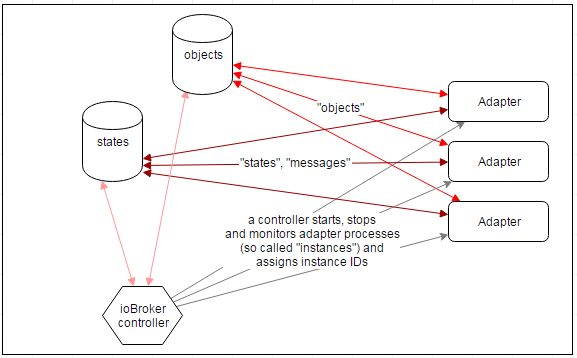

# ioBroker

ioBroker ist eine Integrationsplattform für das [Internet der Dinge](http://en.wikipedia.org/wiki/Internet_of_Things),
mit Fokus auf Gebäudeautomatisierung, Smart Metering, Ambient Assisted Living, Prozessautomatisierung, Visualisierung und
Datenerfassung. Es wie eine Software z.B. [fhem](http://fhem.de), [OpenHAB](http://www.openhab.org/) oder
[the thing system](http://thethingsystem.com/).

## Konzept

ioBroker ist nicht nur eine Anwendung, sondern eher ein Konzept, ein Datenbankschema, und bietet eine sehr einfache Möglichkeit für Systeme
ioBroker definiert einige gemeinsame Regeln für ein Paar von Datenbanken, die zum Austausch von Daten und zur Veröffentlichung von Ereignissen
zwischen verschiedenen Systemen.



### Datenbanken

ioBroker verwendet eine "In-Memory"-Datenbank, um die Daten zu halten und speichert sie in angemessenen Abständen auf der Festplatte. Es gibt zwei Arten von
Speicherung:
- Zustände (Werte)
- Objekte (Meta-/Konfigurationsinformationen)

Zustände können in "In-Memory" oder in Redis gespeichert werden. Objekte können nur in einer "In-Memory"-DB gespeichert werden.

[Redis] (http://redis.io/) ist ein In-Memory-Schlüsselwert-Datenspeicher und außerdem ein Nachrichten-Broker mit Publish/Subscribe-Muster.
Es wird verwendet, um alle Zustände angeschlossener Systeme zu verwalten und zu veröffentlichen.

### Adapter

Systeme werden über so genannte Adapter an ioBrokers Datenbanken angeschlossen, die technisch gesehen Prozesse sind, die irgendwo im Netzwerk laufen und alle Arten von
im Netzwerk laufen und alle Arten von Systemen mit ioBrokers-Datenbanken verbinden. Eine Verbindung zu ioBrokers-Datenbanken kann
Programmiersprache auf nahezu jeder Plattform implementiert werden und ein Adapter kann auf jedem Host laufen, der in der Lage ist, die Datenbanken über
die Datenbanken über ein IP-Netzwerk zu erreichen.

Ein Bibliotheksmodul zur schnellen und komfortablen Adapterentwicklung existiert bisher für Javascript/Node.js. Bibliotheken für
Adapterentwicklung in anderen Sprachen sind geplant (Python, Java, Perl, ...).

Siehe aktuelle Liste der Adapter auf [iobroker.net](http://iobroker.net/#en/adapters)

### Sicherheit

ioBroker ist für den Zugriff von vertrauenswürdigen Adaptern in vertrauenswürdigen Netzwerken konzipiert. Das bedeutet, dass es normalerweise keine
Das bedeutet, dass es in der Regel keine gute Idee ist, die ioBroker-Datenbanken, -Adapter oder Smart Home-Geräte direkt dem Internet auszusetzen oder generell
in einer Umgebung, in der nicht vertrauenswürdige Clients direkt auf diese Netzwerkdienste zugreifen können. Adapter, die Dienste anbieten
die dem Internet ausgesetzt werden sollen, sollten mit Vorsicht behandelt werden. Sie sollten immer **HTTPS** aktivieren und gültige
Zertifikate für Web, Admin verwenden, wenn sie für das Internet geöffnet sind oder z.B. mit zusätzlichen Sicherheitsmaßnahmen wie VPN,
VLAN und Reverse-Proxies.

## Voraussetzungen
Diese Installationsschritte sind nur für Linux, bitte führen Sie sie nicht in Ihrer ioBroker-Docker-Umgebung oder unter Windows aus

Basissystem, wie ubuntu oder debian, läuft und ist aktuell  
[ ] NodeJS installiert ([siehe hier](./03.ProxmoxLXC.md#NodeJS))

## ioBroker installieren
Um sicherzustellen, dass ioBroker korrekt mit allen Abhängigkeiten und erforderlichen Einstellungen (wie Ordner-ACL und Bibliotheken) installiert wird, hat das ioBroker-Team ein mächtiges Installationsskript erstellt, das eine ordnungsgemäße Installation gewährleistet!  
Geben Sie einfach ```curl -sLf https://iobroker.net/install.sh | bash -``` ein und das Installationsprogramm wird den Rest erledigen  
Nach einigen Minuten sollten Sie sehen :
```
Installation der Voraussetzungen (1/4)
ioBroker-Benutzer und -Verzeichnis anlegen (2/4)
Installieren von ioBroker (3/4)
Installation abschließen (4/4)

ioBroker wurde erfolgreich installiert
Öffnen Sie http://xxx.xxx.xxx.xxx:8081 in einem Browser und beginnen Sie mit der Konfiguration!
```

IoBroker ist einsatzbereit, und der Admin ist unter http://xxx.xxx.xxx.xxx:8081 zu erreichen.

Viel Spaß!