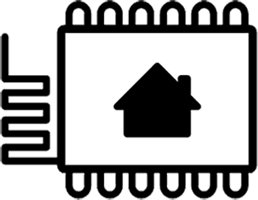

# ESPHome

**Tests:** 

Control your ESP8266 / ESP32 with simple but powerful configuration files created and managed by ESPHome.
The adapter connects to devices managed by ESPHome via the native API and ensures that all data is synchronized with every change

This adapter uses the [esphome-native-api] (https://github.com/Nafaya/esphome-native-api#readme) with all credits to @Nafaya, thanks!

## Prerequisites

You should be familiar how to use ESPHome and have a devices/sensor configured.  
Please ensure the API is activated as the adapter will interact by ESPHome native API, you can define a password if needed
[See ESPHome API refference](https://esphome.io/components/api.html?highlight=api)
